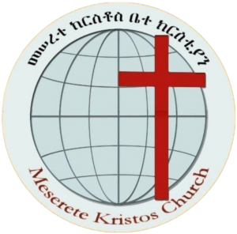

# ✝️ North Nazareth Meserete Kirstos Church Website

Welcome to the official repository for the **North Nazareth Meserete Kirstos Church (NNMKC)** website!  
This project is built with [Next.js](https://nextjs.org) and aims to serve as a digital home for our faith community.  
Experience faith, fellowship, and spiritual growth online! 🙏🌱

---

## 🚀 Getting Started

To run the project locally:

```bash
npm install
npm run dev
# or
yarn install
yarn dev
# or
pnpm install
pnpm dev
# or
bun install
bun dev
```

Open [http://localhost:3000](http://localhost:3000) in your browser to view the site.

---

## 🛠️ Project Structure

---

## ✨ Features

- Beautiful hero section with church logo background
- Responsive navigation bar
- About, Programs, and Contact sections
- Sunday Sermons page
- Animated scroll indicator
- Custom favicon and branding
- Fully responsive and mobile-friendly design

---

## 📚 Learn More

- [Next.js Documentation](https://nextjs.org/docs) – Learn about Next.js features and API.
- [Learn Next.js](https://nextjs.org/learn-pages-router) – Interactive Next.js tutorial.
- [Vercel Platform](https://vercel.com/new?utm_medium=default-template&filter=next.js&utm_source=create-next-app&utm_campaign=create-next-app-readme) – Deploy your Next.js app with ease.

---

## 🌍 Deployment

The easiest way to deploy your Next.js app is with [Vercel](https://vercel.com/), the creators of Next.js.

Check out the [Next.js deployment documentation](https://nextjs.org/docs/pages/building-your-application/deploying) for more details.

---

## 🤝 Contributing

We welcome contributions!  
Feel free to open issues or submit pull requests to help improve the site.

---

## 📸 Screenshots



---

## 🙏 Acknowledgements

- Built with [Next.js](https://nextjs.org)
- Inspired by the love and faith of the NNMKC community

---

> _"A place where faith meets community, and hearts find their home in Christ."_ ✝️❤️
